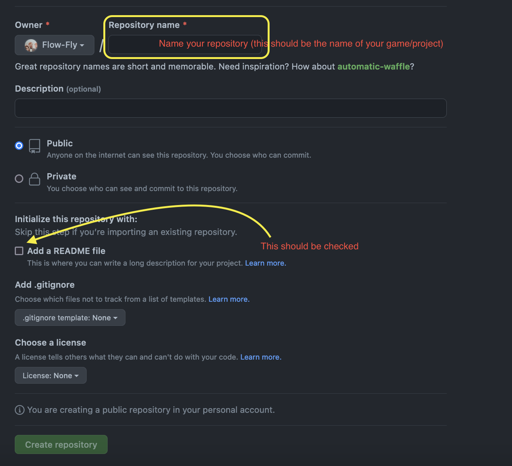

# Create a repository on Github

> Three main actions of git actively described

## Create a repo

Go to github!
Next to your profile picture (on the top-right) you should see a "+" icon.

By clicking on it you will be able to create a new repository.

 

 

- Pick a name for your project
- Select "add a README"
- click the big green button :)

 

 
- Copy the link to your repository.

Now in your terminal, use `cd` to go were you would like to have your files for your project and than in the terminal write `git clone the-link-you-just-copied`

There you go !

Now try to create an `index.html` file, use `git add` to track it, `git commit -m "first commit"` to stage it, `git push` to well, push it online !

 
 

